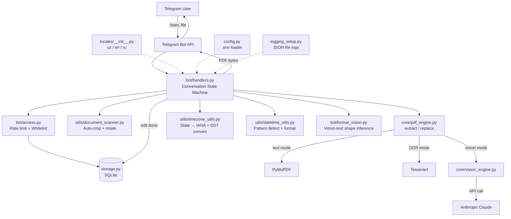

# BOL Bot Arxitekturasi



## Conversation State Machine

```
   /start
     │
     ▼
┌─────────────┐  file (PDF/photo)
│WAITING_FILE │──────────────────┐
└─────────────┘                  │
                                 ▼
                          ┌──────────────┐  (pick_N / vpick_N)
                          │CHOOSING_FIELD│──────────────┐
                          └──────────────┘              │
                                                        ▼
                                                 ┌─────────────────┐
                                                 │CHOOSING_TIMEZONE│
                                                 └─────────────────┘
                                                        │ (tz_XXX)
                                                        ▼
                                                  ┌──────────────┐
                                                  │CHOOSING_MONTH│
                                                  └──────────────┘
                                                        │ (month_N)
                                                        ▼
                                                  ┌──────────────┐
                                                  │CHOOSING_YEAR │
                                                  └──────────────┘
                                                        │ (year_YYYY)
                                                        ▼
                                                 ┌────────────────┐
                                                 │WAITING_NEW_TIME│
                                                 └────────────────┘
                                                        │ (text)
                                                        ▼
                                                  ┌──────────┐
                                                  │CONFIRMING│──┐
                                                  └──────────┘  │ confirm_yes(_delta/_group)
                                                                ▼
                                                          [edit + send PDF]
                                                                │
                                                                ▼
                                                       "more" → CHOOSING_FIELD
                                                       "done" → END
```

## Mode selection logic

```
                   ┌──────────────┐
                   │  Input file  │
                   └──────┬───────┘
                          │
                ┌─────────┴─────────┐
              PDF                  image
                │                    │
                ▼                    ▼
        is_scanned_pdf()      auto-crop + rotate
                │                    │
        ┌───────┴────┐               │
       no           yes              │
        │            │               │
        ▼            └───────┬───────┘
   mode=text                 │
        │            ┌───────┴────────┐
        │       OCR finds ≥1?       no candidates
        │            │                │
        │           yes               ▼
        │            │           ENABLE_VISION?
        │            ▼                │
        │       mode=ocr            yes → vision_engine → mode=vision
        │                             no → "couldn't find anything"
        ▼
     present candidates
```
